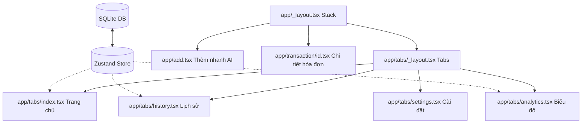

# Tiến Độ Dự Án & Lộ Trình Phát Triển SpendSnap 🚀

Tài liệu này theo dõi trạng thái triển khai hiện tại, các lỗi nghiêm trọng đã được khắc phục, các thành tựu về mặt kiến trúc và các bước tiếp theo cần thực hiện để hoàn thiện và đưa **SpendSnap**—ứng dụng quản lý tài chính cá nhân cao cấp tích hợp AI—đến mức hoàn thiện 100%.

---

## 📊 Tóm Tắt Nhanh & Chỉ Số Sức Khỏe Dự Án

| Chỉ số | Trạng thái | Ghi chú |
| :--- | :--- | :--- |
| **Quét Camera Trực Tiếp** | 🟢 Đã hoàn thành | Chụp ảnh trực tiếp từ thiết bị + Chuyển đổi mã hóa Base64 |
| **Nhận Diện OCR & Trích Xuất** | 🟢 Đã hoàn thành | Bộ phân tích ngữ cảnh tiền VND (`50k` -> `50000`) & 3 lớp dự phòng |
| **Ghi Âm Giọng Nói AI (STT)** | 🟢 Đã hoàn thành | Phân tích giọng nói thành văn bản & trích xuất AI tự động |
| **Giao Diện Fintech UI/UX** | 🟢 Đã hoàn thành | Phong cách màu pastel sang trọng, tối ưu bởi NativeWind v4 |
| **Độ Ổn Định Giao Diện & Định Tuyến** | 🟢 Ổn định | Không còn lỗi mất context định tuyến hay sập dynamic class |
| **Đồng Bộ Đám Mây & Bảo Mật** | 🟡 Danh sách chờ | Sẵn sàng để tích hợp đồng bộ dữ liệu với Supabase |

> [!NOTE]
> Tất cả các lỗi sập ứng dụng nghiêm trọng trước đây, bao gồm việc mất ngữ cảnh điều hướng (navigation context) và xung đột trình biên dịch giao diện động, đều đã được khắc phục hoàn toàn bằng lập trình phòng thủ chuẩn sản xuất thương mại.

---

## 🛠️ 1. Các Tính Năng Đã Hoàn Thành & Lỗi Đã Sửa

### 🌟 Nâng Cấp Giao Diện Trực Quan Cao Cấp (Đang hoạt động)
* **Bảng màu HSL tuyển chọn:** Thay đổi hoàn toàn giao diện sơ sài cũ thành tông màu tím đậm (violet) kết hợp ngọc lục bảo (emerald) mang phong cách Fintech cao cấp.
* **Thẻ ví điện tử phát sáng (Wallet Glow):** Thiết kế thẻ kỹ thuật số trực quan với các bong bóng phát sáng dạng kính mờ (glassmorphism) và thanh tiến trình hạn mức chi tiêu thực tế.
* **Viên nang lọc trượt ngang:** Tích hợp bộ phím bấm lọc nhanh trượt ngang mềm mại (`Tất cả`, `Ăn uống`, `Cà phê`, `Giải trí` v.v.) để tìm kiếm giao dịch ngay lập tức.
* **Bộ huy hiệu rực rỡ:** Thiết kế riêng các biểu tượng danh mục có màu nền pastel hài hòa cho từng mục chi tiêu.

### 🎥 Quét Camera Trực Tiếp & Trích Xuất Hóa Đơn OCR
* **Cơ chế Base64 đa tầng dự phòng:** Xây dựng quy trình xử lý ảnh 3 lớp trong [ocr.ts](file:///d:/app_tai_chinh/spendsnap/services/ocr.ts) tích hợp API `File` hướng đối tượng mới của Expo SDK 54, các hàm wrapper cũ, và bộ chuyển đổi URI mặc định.
* **Phân tích tiếng Việt thông minh:** Tối ưu hóa câu lệnh prompt gửi cho mô hình `gpt-4o-mini` để đọc hiểu các tên tiếng Việt (ví dụ: `Phở gà`, `Highlands Coffee`), tự động dịch ngôn ngữ viết tắt (`30k` -> `30000`, `1.2tr` -> `1200000`), và gán danh mục chính xác.
* **Tích hợp Camera vật lý:** Thiết lập phân quyền camera phần cứng trực tiếp trong ứng dụng và bổ sung giao diện so sánh trực quan giữa Chụp ảnh quét trực tiếp và Chọn ảnh từ thư viện trong [add.tsx](file:///d:/app_tai_chinh/spendsnap/app/add.tsx).

### 🐛 Khắc Phục Lỗi Định Tuyến & Lỗi Dựng Hình Do Dynamic Class
* **Điều hướng lập trình (`router.push`):** Loại bỏ hoàn toàn các thẻ `<Link href="..." asChild>` lồng trong danh sách `FlatList` - nguyên nhân gây lỗi mất ngữ cảnh `"couldn't find a navigation context"` khi tải lại hoặc thay đổi bộ lọc nhanh.
* **Phân tích Class tĩnh:** Giải quyết xung đột giao diện NativeWind v4 bằng cách chuyển toàn bộ chuỗi biểu thức điều kiện động (như `` active ? "bg-indigo-600" : "bg-white" ``) thành các biến chuỗi tĩnh trước khi truyền vào giao diện.
* **Phòng thủ ngày tháng an toàn:** Bổ sung cơ chế làm sạch và kiểm tra dữ liệu ngày tháng (Date Sanitisation) trong tầng lưu trữ Zustand `refreshAll()` và màn hình chi tiết hóa đơn [[id].tsx](file:///d:/app_tai_chinh/spendsnap/app/transaction/\[id\].tsx). Nếu hóa đơn OCR trả về ngày bị trống hoặc không hợp lệ, màn hình chi tiết sẽ hiển thị an toàn mà không bao giờ bị lỗi sập màn hình (Render Error).

---

## 📋 2. Tổng Quan Kiến Trúc Ứng Dụng Hiện Tại

Sơ đồ liên kết dữ liệu và điều hướng của ứng dụng đã được ổn định:

---

## 🚀 3. Các Bước Tiếp Theo & Lộ Trình Phát Triển

Để đưa **SpendSnap** đạt đến sự hoàn hảo tuyệt đối sẵn sàng phát hành trên App Store / Google Play Store, dưới đây là các đầu việc cần triển khai tiếp theo:

### 🟩 Giai đoạn A: Tùy Chỉnh Danh Mục & Thiết Lập Hạn Mức (Khuyên dùng)
- [x] **Giao diện quản lý danh mục:** Đã thêm màn `/categories` (modal) để tạo/xoá danh mục, chọn emoji + màu + budget theo danh mục (lưu SQLite).
- [x] **Tùy biến hạn mức ngân sách:** Đã thêm màn `/budget` (modal) để chỉnh Monthly Budget (lưu SQLite qua `app_settings`), Settings hiển thị đúng giá trị.

### 🟨 Giai đoạn B: Đa Tiền Tệ & Bộ Lọc Nâng Cao
- [ ] **Chuyển đổi đa tiền tệ:** Hỗ trợ nhập và hiển thị chi tiêu theo USD, EUR, JPY với tỷ giá quy đổi cập nhật hàng ngày.
- [x] **Xuất dữ liệu Excel/CSV:** Đã thêm nút Export CSV trên màn History (web tải xuống, mobile share file `.csv`).
- [x] **Bộ lọc thời gian linh hoạt:** Đã thêm filter *This week*, *Last 30d*, *Custom (YYYY-MM-DD)* + lọc trực tiếp trên danh sách.

### 🟦 Giai đoạn C: Kích Hoạt Sao Lưu Đám Mây
- [ ] **Kết nối đám mây Supabase:** Đã có module sync + toggle Settings (anonymous auth), cần cấu hình `EXPO_PUBLIC_SUPABASE_URL/ANON_KEY` và tạo bảng/policy theo `supabase.sql` để chạy thực tế.

### 🟥 Giai đoạn D: Đóng Gói Và Phát Hành Ứng Dụng
- [ ] **Tạo biểu tượng & màn hình chào:** Thiết kế và đóng gói biểu tượng ứng dụng (`icon.png`) cùng màn hình chào sinh động (`splash-image.png`).
- [ ] **Cấu hình Expo EAS Build:** Thiết lập các thông số đóng gói `eas.json` để biên dịch ứng dụng thành tệp cài đặt `.apk`, `.aab` (cho Android) và `.ipa` (cho iOS) phiên bản thương mại thực tế.

---

> [!TIP]
> Hãy duy trì và cập nhật tệp `progress.md` này trong mã nguồn của bạn để theo dõi các đầu việc khi tiếp tục hoàn thiện ứng dụng SpendSnap nhé!
